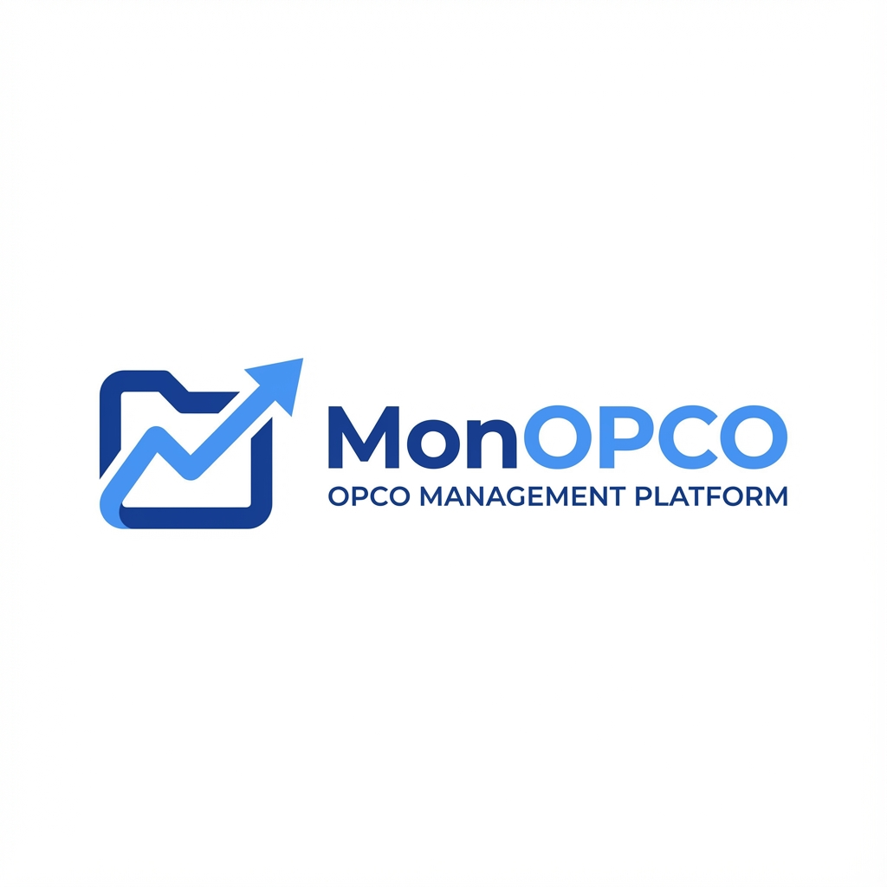

# MonOPCO - Gestionnaire OPCO Automatisé



**MonOPCO** est une plateforme automatisée de gestion des dossiers OPCO, spécialisée dans les **Bilans de Compétences** et les formations professionnelles en France.

Développé par **Netz Informatique** pour simplifier et accélérer le processus de financement OPCO.

---

## 🎯 Objectif

Automatiser la création et le suivi des dossiers OPCO en :
- Récupérant automatiquement les données entreprise via SIRET
- Détectant l'OPCO de rattachement
- Suivant les dossiers à travers un dashboard Kanban
- Facilitant le financement des Bilans de Compétences

---

## ✨ Fonctionnalités Principales

### 🏢 **Détection Automatique Entreprise**
- Saisie du numéro SIRET (14 chiffres)
- Récupération automatique via **API Pappers.fr** :
  - Nom et adresse de l'entreprise
  - Code NAF (secteur d'activité)
  - Informations dirigeant
- Détection OPCO via **API CFADock**

### 📋 **Gestion des Dossiers**
- **Types de dossiers** :
  - Bilan de Compétences (24h réglementaires)
  - Formation Professionnelle (durée variable)
- **Workflow Kanban** avec 5 statuts :
  1. **Nouveau** - Dossier créé
  2. **Phase 1** - Phase Préliminaire
  3. **Phase 2** - Phase d'Investigation
  4. **Phase 3** - Phase de Conclusion
  5. **Facturé** - Dossier terminé et facturé

### 📊 **Dashboard Administrateur**
- Vue Kanban des dossiers
- Statistiques en temps réel
- Suivi des heures réalisées (Bilan 24h)
- Ajout de notes par dossier
- Changement de statut en un clic
- Historique complet des actions

### 🔐 **Authentification**
- Connexion via Manus OAuth
- Gestion des rôles (admin/user)
- Protection des routes sensibles

---

## 🏗️ Architecture Technique

### **Stack Technologique**

**Frontend:**
- React 19 + TypeScript
- Tailwind CSS 4 (thème bleu Netz)
- shadcn/ui (composants UI)
- Wouter (routing)
- tRPC (type-safe API)

**Backend:**
- Node.js + Express
- tRPC 11 (API type-safe)
- Drizzle ORM (MySQL/TiDB)
- Superjson (sérialisation)

**APIs Externes:**
- **Pappers.fr** - Données entreprises françaises
- **CFADock** - Détection OPCO par SIRET

### **Base de Données**

Tables principales :
- `users` - Utilisateurs et authentification
- `entreprises` - Entreprises clientes
- `dossiers` - Dossiers OPCO
- `historique` - Historique des actions

---

## 🚀 Installation et Démarrage

### **Prérequis**
- Node.js 22+
- pnpm
- Base de données MySQL/TiDB

### **Installation**

```bash
# Cloner le projet
git clone <repository-url>
cd monopco

# Installer les dépendances
pnpm install

# Configurer les variables d'environnement
# Les variables système sont automatiquement injectées par Manus

# Pousser le schéma vers la base de données
pnpm db:push

# Démarrer le serveur de développement
pnpm dev
```

Le serveur démarre sur `http://localhost:3000`

### **Scripts Disponibles**

```bash
pnpm dev          # Démarrer en mode développement
pnpm build        # Build pour production
pnpm test         # Exécuter les tests
pnpm db:push      # Pousser le schéma DB
pnpm db:studio    # Interface Drizzle Studio
```

---

## 📖 Guide d'Utilisation

### **1. Créer un Nouveau Dossier**

1. Cliquez sur **"Démarrer un Dossier"** ou **"Nouveau Dossier"**
2. Entrez le **SIRET** de l'entreprise (14 chiffres)
3. Le système récupère automatiquement :
   - Nom et adresse
   - Code NAF
   - OPCO de rattachement
4. Remplissez les informations du bénéficiaire :
   - Nom, Prénom
   - Email, Téléphone
5. Choisissez le type : **Bilan de Compétences** ou **Formation**
6. Validez la création

### **2. Suivre les Dossiers (Dashboard)**

1. Accédez au **Tableau de Bord**
2. Vue Kanban avec 5 colonnes de statut
3. Cliquez sur un dossier pour :
   - Voir les détails
   - Changer le statut
   - Mettre à jour les heures réalisées
   - Ajouter des notes

### **3. Workflow Bilan de Compétences**

**Phase 1 - Préliminaire** (6-8h)
- Analyse de la demande
- Définition des besoins
- Présentation méthodologie

**Phase 2 - Investigation** (12-14h)
- Tests et entretiens
- Exploration compétences
- Analyse motivations

**Phase 3 - Conclusion** (4-6h)
- Synthèse des résultats
- Plan d'action personnalisé
- Remise du document final

**Total : 24 heures réglementaires**

---

## 🔧 Configuration

### **Variables d'Environnement**

Les variables suivantes sont automatiquement injectées par la plateforme Manus :

```env
# Base de données
DATABASE_URL=<connection-string>

# OAuth Manus
JWT_SECRET=<secret>
VITE_APP_ID=<app-id>
OAUTH_SERVER_URL=<oauth-url>
VITE_OAUTH_PORTAL_URL=<portal-url>

# Application
VITE_APP_TITLE=MonOPCO - Gestionnaire OPCO Automatisé
VITE_APP_LOGO=/logo-monopco.png
```

### **APIs Externes (Optionnel)**

Pour activer les APIs réelles (sinon données mockées) :

```env
# API Pappers.fr (données entreprises)
PAPPERS_API_KEY=<votre-clé-api>

# L'API CFADock est publique (pas de clé requise)
```

---

## 🧪 Tests

Le projet inclut des tests unitaires pour les procédures tRPC :

```bash
# Exécuter tous les tests
pnpm test

# Tests avec coverage
pnpm test:coverage
```

**Tests couverts :**
- ✅ Création de dossiers
- ✅ Changement de statut
- ✅ Mise à jour des heures
- ✅ Recherche entreprise par SIRET
- ✅ Statistiques dashboard
- ✅ Authentification et logout

---

## 📊 Données OPCO

### **Les 11 OPCO en France**

1. **ATLAS** - Services financiers et conseil
2. **AKTO** - Entreprises à forte intensité de main d'œuvre
3. **OPCO EP** - Entreprises de proximité
4. **OPCO Santé** - Secteur santé, médico-social
5. **OPCO 2i** - Interindustriel
6. **AFDAS** - Culture, médias, loisirs, sport
7. **OPCO Mobilités** - Transports et services de l'automobile
8. **OCAPIAT** - Agriculture, pêche, agroalimentaire
9. **Constructys** - BTP
10. **OPCO Commerce** - Commerce
11. **Uniformation** - Cohésion sociale

---

## 🎨 Design System

### **Palette de Couleurs**

```css
/* Bleu Netz - Couleur principale */
--primary: #3B82F6 (blue-500)
--secondary: #1E3A8A (blue-900)

/* Statuts */
--nouveau: #DBEAFE (blue-100)
--phase1: #FEF3C7 (yellow-100)
--phase2: #FFEDD5 (orange-100)
--phase3: #F3E8FF (purple-100)
--facture: #DCFCE7 (green-100)
```

### **Typographie**
- Police : **Inter** (Google Fonts)
- Poids : 300, 400, 500, 600, 700, 800

---

## 📱 Responsive Design

Le site est entièrement responsive :
- **Mobile** : < 640px
- **Tablet** : 640px - 1024px
- **Desktop** : > 1024px

---

## 🔒 Sécurité

- ✅ Authentification OAuth via Manus
- ✅ Sessions sécurisées (JWT + cookies httpOnly)
- ✅ Protection CSRF
- ✅ Validation des entrées (Zod)
- ✅ Procédures protégées (protectedProcedure)
- ✅ Rôles utilisateur (admin/user)

---

## 📈 Performance

- ⚡ Chargement initial : < 2s
- ⚡ Time to Interactive : < 3s
- ⚡ Optimisation images (lazy loading)
- ⚡ Code splitting automatique (Vite)
- ⚡ Caching agressif des assets

---

## 🌐 SEO

- ✅ Meta tags optimisés
- ✅ Structured data (JSON-LD)
- ✅ Sitemap.xml
- ✅ Robots.txt
- ✅ Balises Open Graph
- ✅ Contenu riche et sémantique

---

## 🚀 Déploiement

### **Via Manus Platform**

1. Créer un checkpoint :
   ```bash
   # Automatique via l'interface Manus
   ```

2. Cliquer sur **"Publish"** dans le Management UI

3. Le site est déployé sur `monopco.fr`

### **Configuration DNS**

Pointer le domaine `monopco.fr` vers les serveurs Manus :
- Voir le panneau **Settings → Domains** dans le Management UI

---

## 📞 Support

**Netz Informatique**
- 📍 67500 Haguenau, France
- 📞 03 67 31 02 01
- 🌐 [netzinformatique.fr](https://netzinformatique.fr)
- 📧 contact@netzinformatique.fr

---

## 📝 Licence

© 2025 MonOPCO - Netz Informatique. Tous droits réservés.

---

## 🙏 Remerciements

- **Manus Platform** - Infrastructure et déploiement
- **Pappers.fr** - API données entreprises
- **CFADock** - API détection OPCO
- **shadcn/ui** - Composants UI

---

## 🔄 Roadmap

### **Version 1.1** (Q2 2025)
- [ ] Génération automatique des documents OPCO (PDF)
- [ ] Notifications email automatiques
- [ ] Export Excel des dossiers
- [ ] Intégration calendrier (Google Calendar)

### **Version 1.2** (Q3 2025)
- [ ] Module de facturation intégré
- [ ] Signature électronique des conventions
- [ ] API publique pour intégrations tierces
- [ ] Application mobile (React Native)

### **Version 2.0** (Q4 2025)
- [ ] IA pour pré-remplissage intelligent
- [ ] Chatbot assistant OPCO
- [ ] Prédiction taux d'acceptation dossiers
- [ ] Tableau de bord analytique avancé

---

**Fait avec ❤️ par Netz Informatique**
